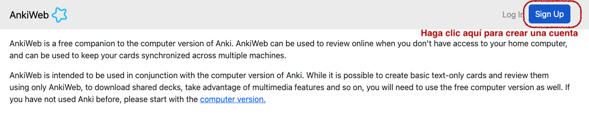
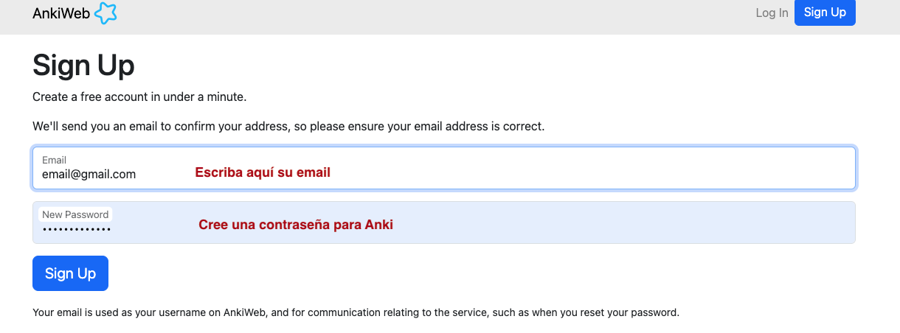
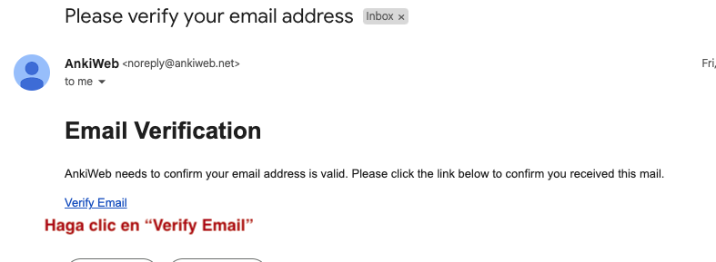
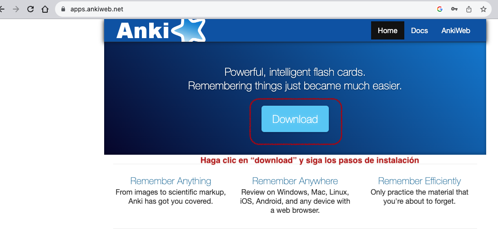
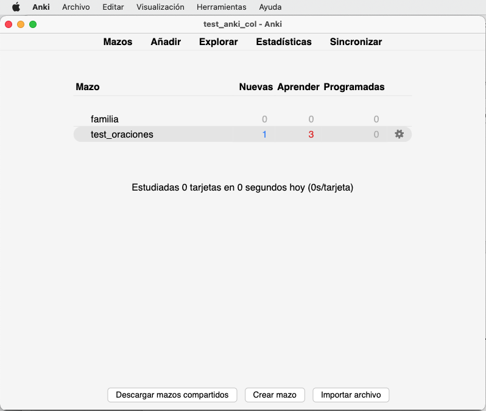
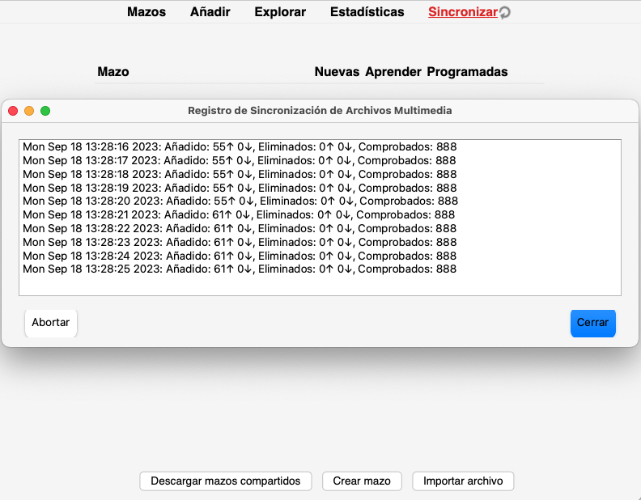
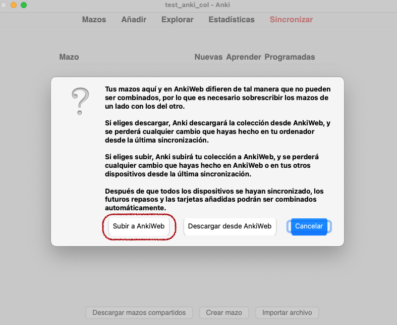

# (PART\*) **INSTRUCCIONES EN ESPAÑOL** {-} 

# Instrucciones para crear una cuenta en Anki y descargar el repositorio {#cross_0}

## Cree una cuenta en Anki. 

En su computador, cree una cuenta de Anki. La cuenta se crea de forma **gratuita** en la siguiente página web.

<https://ankiweb.net/account/signup>

```{r echo=FALSE, out.width='90%', layout="l-body-outset"}

```


## Escriba su email y cree una contraseña para Anki. {#cross_1}

```{r echo=FALSE, out.width='90%', layout="l-body-outset"}

```


## Verifique su email.

Le llegará un correo electrónico a la cuenta de correo que usted indicó. *Verifique* la cuenta dando clic en el enlace que le llegó a su correo.

```{r echo=FALSE, out.width='90%', layout="l-body-outset"}

```


## Descargue Anki en su computador. 

Descargue Anki en su *computador*, desde la siguiente página web:

<https://apps.ankiweb.net/>

```{r echo=FALSE, out.width='60%', layout="l-body-outset"}

```


## Instale Anki en su computador. 

Siga el proceso de instalación de Anki en su computador. Una vez terminada la instalación, Anki se verá *similar* a la imagen que se muestra a continuación:

```{r echo=FALSE, out.width='60%', layout="l-body-outset"}

```


## De clic en sincronizar. 

```{r echo=FALSE, out.width='60%', layout="l-body-outset"}
knitr::include_graphics("images/reposit_sp/clic_sincronizar.png")
```


## Ingrese su email y contraseña. [Las que creó anteriormente en el paso 1.2](#cross_1).  


## Descargue el repositorio. 

*Nota:* Intentamos hacer oraciones con género gramatical neutro, pero hay algunas que tienen marcadores de género (p.ej., estoy preocupad**a** vs. Estoy preocupad**o**). 

Existen dos archivos, uno con género gramatical femenino (fem.colpkg) y uno a género gramatical masculino (mas.colpkg). Por ejemplo, el archivo femenino tiene oraciones como *estoy tranquila* y el masculino tiene oraciones como *me siento solo.* 

Aun así, las diferencias entre estos dos archivos son mínimas ya que la mayoría de las oraciones se comparten. **Seleccione el archivo con el que se identifique y descárguelo en su computador.** 

Descargue el repositorio aquí descargue uno de los dos archivos, fem.colpkg o mas.colpkg: 

<https://drive.google.com/drive/folders/1UgL4qijIzZTPCvqIir-spHCznOdJrdf8?usp=sharing> 


## Haga doble clic en el archivo que descargó. 

Se va a demorar algunos minutos descargando y sincronizando. Tenga paciencia. Si da clic en *sincronizar* verá algo parecido a la siguiente imagen. 

```{r echo=FALSE, out.width='60%', layout="l-body-outset"}

```


## En caso de que le salga este aviso mientras esté sincronizando, seleccione la opción “Subir a AnkiWeb.” {-}

```{r echo=FALSE, out.width='60%', layout="l-body-outset"}

```


## ¡Listo! 


Una vez *termine de sincronizar* el repositorio, estará listo para ser utilizado. 

El siguiente paso es opcional y se trata de sincronizar el repositorio en su tablet o celular. Usted puede practicar en el computador, en la tablet, o en ambos. 

Si no quiere o no necesita usar su tablet o celular para practicar, entonces pase a [cómo practicar las oraciones.](#cross_4)

