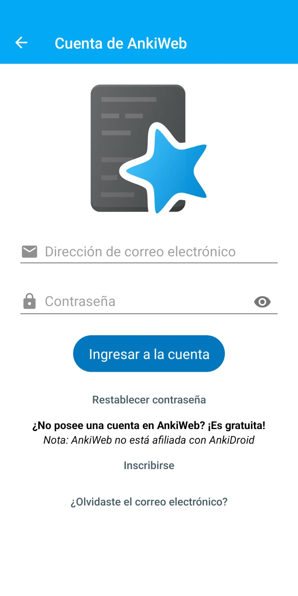

# Instrucciones para usar el repositorio en su tablet o celular 

Tenga en cuenta que, dependiendo de la versión de Anki, el repositorio *puede no funcionar correctamente en su tableta o teléfono inteligente*. Por lo tanto, recomendamos usarlo solo en su computador. Los pasos que mencionamos a continuación son opcionales. 

Para seguir estos pasos debe haber **completado** las [instrucciones para crear una cuenta en Anki y bajar el repositorio a su computador.](#cross_0)

## Abra su App store (si tiene un iPhone) o Play store (si tiene un Android). 


## Busque la aplicación llamada Anki. 

El *ícono* de Anki se parece al siguiente: 

```{r echo=FALSE, out.width='10%', layout="l-body-outset"}
knitr::include_graphics("images/reposit_sp/Anki_logo.png")
```


## Descargue la aplicación.

Descargue la aplicación en su tablet o celular. Tenga en cuenta que Anki es **gratis en Google play**, pero es de **pago en el App Store**.


## Vincular su cuenta. 

Entre a la aplicación de Anki y de clic en las *tres líneas* que se encuentran generalmente en la parte izquierda de la pantalla

```{r echo=FALSE, out.width='30%', layout="l-body-outset"}
knitr::include_graphics("images/reposit_sp/tres_lineas.png")
```


## Seleccionar estas tres líneas abrirá el menú que se observa a continuación. 

Seleccione en donde dice *configuración*

```{r echo=FALSE, out.width='30%', layout="l-body-outset"}

```


## Ahora seleccione la opción de “sincronización”

```{r echo=FALSE, out.width='30%', layout="l-body-outset"}
knitr::include_graphics("images/reposit_sp/config_sincro.jpg")
```


## Seleccione la opción “Cuenta de AnkiWeb.” 

Ponga su email y contraseña.[El mismo email y contraseña que usó para crear la cuenta en Anki](#cross_1)

```{r echo=FALSE, out.width='30%', layout="l-body-outset"}

```

**Nota:** Puede ser también que deba ingresar su email y contraseña de Anki tan pronto abra la aplicación

```{r echo=FALSE, out.width='30%', layout="l-body-outset"}

```


## Se tomará unos minutos en sincronizar y luego verá el repositorio. 
