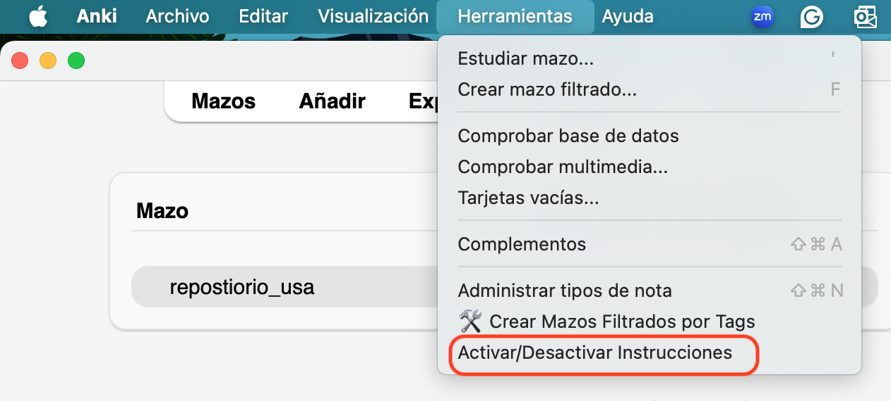
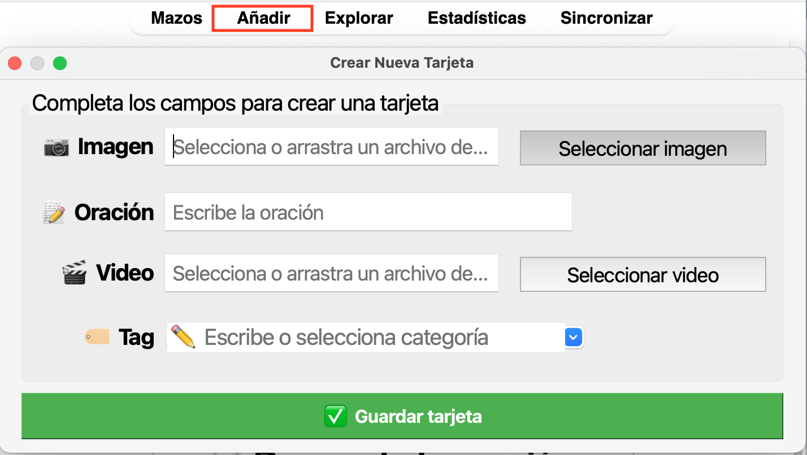

# Pasos para estudiar oraciones {#cross_4}

*Nota:* En el siguiente video de apoyo se describen los pasos que deben seguir cada vez que vean una imagen/oración nueva. Es muy importante practicar siguiendo estos pasos. 

<https://youtu.be/v-dNBT08lm0?si=_ehTlVFt6bwPHegl>

Ustedes pueden seguir estos pasos directamente desde su computador activando las instrucciones en Anki (también las pueden desactivar una vez que hayan memorizado cada paso). Para activar las instrucciones den clic en herramientas y después den clic en la opción de Activar/Desactivar Instrucciones. 

```{r echo=FALSE, out.width='70%', layout="l-body-outset"}

```


Además, en el siguiente link encontrarán los pasos de práctica para que los descarguen y los mantengan cerca de su computador.

<https://drive.google.com/file/d/17YQczy3QIZr6vow7PPEFlOrd2IbLUY2y/view?usp=drive_link>

Los pasos son los siguientes para aprender una oración nueva:

## Escucha {#cross_2}
*Escuchen* la oración dando clic o tocando el ícono  Escuchen SIN hablar. 

## Escucha y señala
Escuchen nuevamente la oración dando clic o tocando el ícono  *Mientras escuchan, señalen* con su dedo palabra por palabra de la oración escrita. 

## Juntos
Intenten decir la oración *al mismo tiempo* que el video. Hagan este paso **dos** veces. Para esto, nuevamente necesitarán dar clic o tocar el ícono  

## Tú solo
Intenten decir la oración *sin* ayuda del video.

## Califica
Califiquen su producción usando las *siguientes opciones*:	

- Otra vez = “no lo logré hacer muy bien y necesito hacerlo otra vez.”

- Regular = “lo hice más o menos”

-	Bien = “lo hice bien”


## ¡Importante! Si es una oración que **ya** han visto, ANTES del [paso 1](#cross_2), intente recordar la oración con ayuda de la imagen. 

## Los pasos descritos aquí son *basados en la evidencia científica* de un tratamiento llamado Script Training. 

## También puede crear sus propias oraciones

Para crear sus propias oraciones, haga clic en "Añadir" y siga las instrucciones.

- Seleccione una imagen única y arrástrela, o seleccione el archivo desde tu computador
- Escriba la oración que quiere añadir.
- Suba un vídeo (similar a los ejemplos; una boca diciendo la oración).
- Escriba un contexto para categorizar su oración; también puede escribir "personal" para indicar que es una de sus propias oraciones.

```{r echo=FALSE, out.width='90%', layout="l-body-outset"}

```

