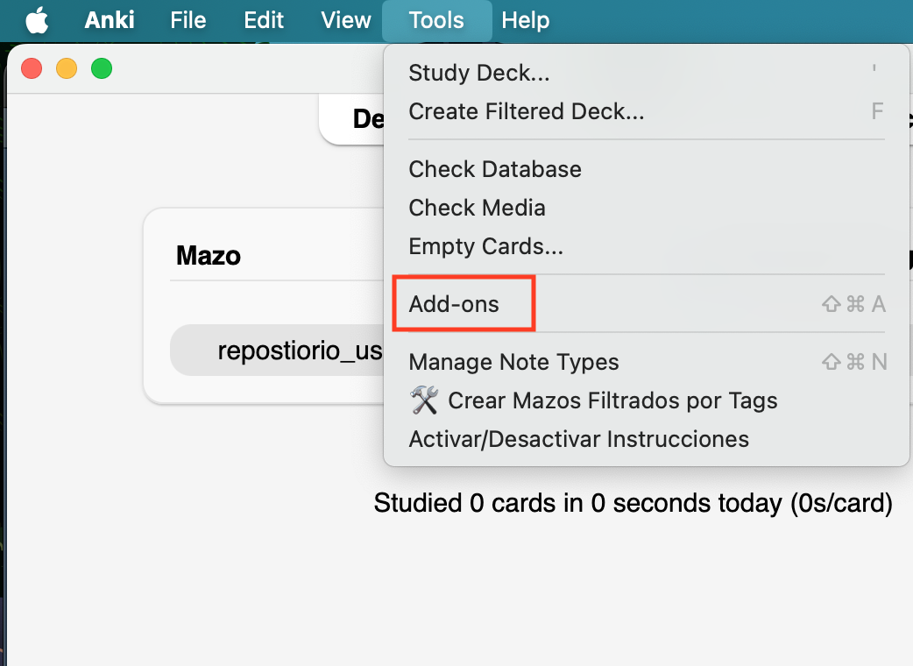

# (PART\*) **INSTRUCTIONS IN ENGLISH** {-}

# Instructions to create an Anki account and download the repository 

## Create an account on Anki.

Using your computer, start by creating an Anki account. Creating an account is **free**. Visit the following website to do so:

<https://ankiweb.net/account/signup>

```{r echo=FALSE, out.width='90%', layout="l-body-outset"}
knitr::include_graphics("images/reposit_en/sign_up.png")
```


## Enter your email and create a password for Anki. {#cross_3}

```{r echo=FALSE, out.width='90%', layout="l-body-outset"}
knitr::include_graphics("images/reposit_en/email_password.png")
```


## Check your email.

An email will be sent to the email account you indicated. *Verify* the account by clicking on the link sent to your email.

```{r echo=FALSE, out.width='90%', layout="l-body-outset"}
knitr::include_graphics("images/reposit_en/email_verification.png")
```


## Download Anki to your computer.

Download Anki to your **computer** from this website:

<https://apps.ankiweb.net/>

```{r echo=FALSE, out.width='60%', layout="l-body-outset"}
knitr::include_graphics("images/reposit_en/download.png")
```


## Install Anki on your computer.

Follow the Anki installation process on your computer. Once the installation is complete, Anki will look *similar* to the image below:

```{r echo=FALSE, out.width='60%', layout="l-body-outset"}
knitr::include_graphics("images/reposit_en/anki_screen.png")
```

## Download the add-on

This add-on was specifically developed for individuals with aphasia.
It offers guided practice instructions, allows you to organize sentences into custom categories, and supports sentence creation tailored to their needs.

To install the plugin: Click Tools in the menu bar. Select add-ons from the dropdown. In the new window, choose Get Add-ons to begin installation.

Enter the following number: **254980899** and click OK. Then, restart Anki.

```{r echo=FALSE, out.width='60%', layout="l-body-outset"}

```

We appreciate and acknowledge the work of engineer Juan Sebastián Angarita in the design of this add-on!

## Click on sync.


## Enter your email and password. [The ones you created previously in 4.2](#cross_3).


## Download the repository.


There are two repositories. The first repository was designed for people with aphasia living in the United States (**repositorio_usa**).

The second repository was designed for people with aphasia in Colombia, but can be used by other countries in Latin America (**repositorio_colombia**). We are grateful to Northwestern University's Global Health Research Catalyzer Funding, which allowed us to create the repository in Colombia.

Select **one** repository and download it. Downloading both repositories will cause errors that will prevent Anki from working properly. **Only download one repository,** whichever you prefer.

Download **one** of the two repositories here: <https://drive.google.com/drive/folders/1UgL4qijIzZTPCvqIir-spHCznOdJrdf8?usp=sharing>

*Note:* We tried to make sentences with neutral grammatical gender, but there are some that have gender markers (e.g., estoy preocupad**a** vs. Estoy preocupad**o**).

## Double click the file you downloaded.

It will take a few minutes to download and synchronize. Have patience. 


## If you see this prompt while synchronizing, select the “Upload to AnkiWeb” option. {-}

```{r echo=FALSE, out.width='60%', layout="l-body-outset"}
knitr::include_graphics("images/reposit_en/subir_a_anki.png")
```


## You are ready!

Once it *finishes synchronizing,* the repository will be ready to be used.

The next step is optional and involves synchronizing the repository on your tablet or phone. Please note that, depending on the version of Anki, the repository *may not function properly on your tablet or smartphone.* So, we recommend using it on your computer only. 

If you don't want or need to use your tablet or phone to practice, then skip to [how to practice sentences.](#cross_5) 