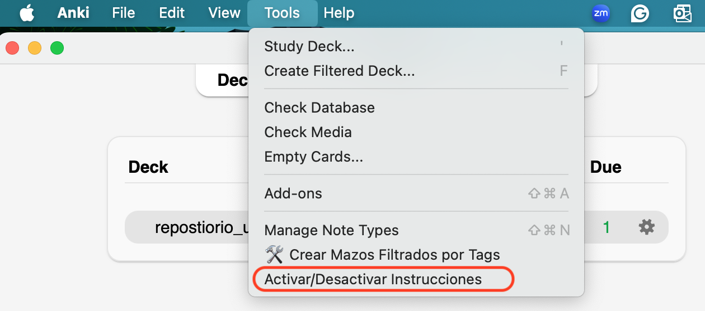

# Steps to study sentences {#cross_5}

*Note:* This support video describes the steps to follow when seeing a new image/sentence.It is very important to practice following these steps.

<https://youtu.be/v-dNBT08lm0?si=_ehTlVFt6bwPHegl>

You can follow these steps directly from your computer by enabling the instructions in Anki (you can also disable them once you've memorized each step). To enable the instructions, click on Tools and then click the Activar/Desactivar Instrucciones option.

```{r echo=FALSE, out.width='70%', layout="l-body-outset"}

```


Additionally, in the link below, you will find the practice steps to keep them close to your computer.

<https://drive.google.com/file/d/17YQczy3QIZr6vow7PPEFlOrd2IbLUY2y/view?usp=drive_link>

The steps are as follows to learn a new sentence:

## Listen {#cross_6}
*Listen* to the sentence by clicking icon  Listen WITHOUT speaking. 

## Listen and point
Listen to the sentence again by clicking the icon  *As you listen*, point with your finger to each word of the written sentence.

## Together
Try saying the sentence *simultaneously * with the video. Do this step **twice.**  For this, you will need to click the icon again 

## You 
Try saying the sentence *without* help from the video.

## Rate
Rate your production using the *following options*:

- Again = “I didn't do it very well and I need to do it again.”

- Almost = “I did it more or less” 

- Good = “I did well”

## Important! If it is a sentence you have **already** seen, BEFORE [step 1](#cross_6), try to remember the sentence with the help of the image.

## The steps described here are *based on scientific evidence* from a treatment called Script Training.

## You can also create your own sentences

To create your own sentences, click on add and then follow the instructions. 
- Select a unique image and drag it, or select the file from your computer
- Write the sentence that you want to add
- Upload a video (similar to the examples; a mouth saying the sentence)
- Write a context to categorize your sentence; you can also write "personal" to indicate that it is one of your own sentences.  

```{r echo=FALSE, out.width='90%', layout="l-body-outset"}

```
