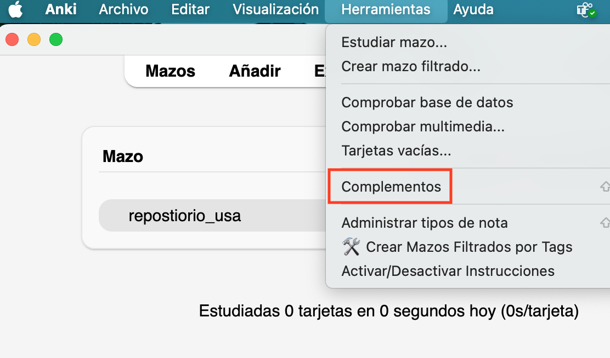

# (PART\*) **INSTRUCCIONES EN ESPAÑOL** {-} 

# Instrucciones para crear una cuenta en Anki y descargar el repositorio {#cross_0}

## Cree una cuenta en Anki. 

En su computador, cree una cuenta de Anki. La cuenta se crea de forma **gratuita** en la siguiente página web.

<https://ankiweb.net/account/signup>

## Escriba su email y cree una contraseña para Anki. {#cross_1}

## Verifique su email.

Le llegará un correo electrónico a la cuenta de correo que usted indicó. Verifique la cuenta dando clic en el enlace que le llegó a su correo.

## Descargue Anki en su computador. 

Descargue Anki en su *computador*, desde la siguiente página web:

<https://apps.ankiweb.net/>

## Instale Anki en su computador. 

Siga el proceso de instalación de Anki en su computador. Una vez terminada la instalación, Anki se verá *similar* a la imagen que se muestra a continuación:

## Descargue el complemento. 

Este complemento es específico para personas con afasia. Está diseñado para proveer instrucciones de práctica, crear categorías para las oraciones, y ayudarlo a crear sus propias oraciones. 

Para instalar el complemento, de click en *herramientas* y luego seleccione *complementos.* Se abrirá una nueva ventana en la que deberá seleccionar *descargar complementos.*

Ingrese el siguiente número: **254980899** y de click en aceptar. Ahora por favor reinicie Anki para que se instale el complemento. 

¡Agradecemos y reconocemos el trabajo del ingeniero Juan Sebastián Angarita en el diseño de este complemento! 

## De clic en sincronizar. 

## Ingrese su email y contraseña. [Las que creó anteriormente en el paso 1.2](#cross_1).  

## Descargue el repositorio. 

Existen dos repositorios. El primer repositorio fue diseñado para personas con afasia viviendo en los Estados Unidos (**repositorio_usa**). 

El segundo repositorio fue diseñado para personas con afasia en Colombia, pero puede ser usado por otros países en latinoamérica (**repositorio_colombia**). Agradecemos a la financiación de Northwestern University, Global Health Research Catalyzer Funding, que nos permitió realizar el repositorio en Colombia. 

Seleccione **1** repositorio y descárguelo. Descargar ambos repositorios va a crear errores que no permiten que Anki funcione adecuadamente. **Solo descargue 1 repositorio,** el que usted prefiera. 

Descargue **uno** de los dos repositorios aquí: <https://drive.google.com/drive/folders/1UgL4qijIzZTPCvqIir-spHCznOdJrdf8?usp=sharing> 

*Nota:* Intentamos hacer oraciones con género gramatical neutro, pero hay algunas que tienen marcadores de género (p.ej., estoy preocupad**a** vs. Estoy preocupad**o**). 

## Haga doble clic en el archivo que descargó. 

Se va a demorar algunos minutos descargando y sincronizando. Tenga paciencia. Si da clic en *sincronizar* verá algo parecido a la siguiente imagen. 

## En caso de que le salga este aviso mientras esté sincronizando, seleccione la opción “Subir a AnkiWeb.” {-}

## ¡Listo! 

Una vez *termine de sincronizar* el repositorio, estará listo para ser utilizado. 

El siguiente paso es opcional e implica sincronizar el repositorio en tu tableta o teléfono. Tenga en cuenta que, según la versión de Anki, el repositorio *podría no funcionar correctamente en su tableta o teléfono*. Por lo tanto, recomendamos usarlo solo en tu computador.

Si no quiere o no necesita usar su tablet o celular para practicar, entonces pase a [cómo practicar las oraciones.](#cross_4)

