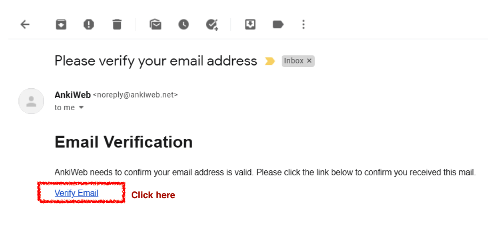
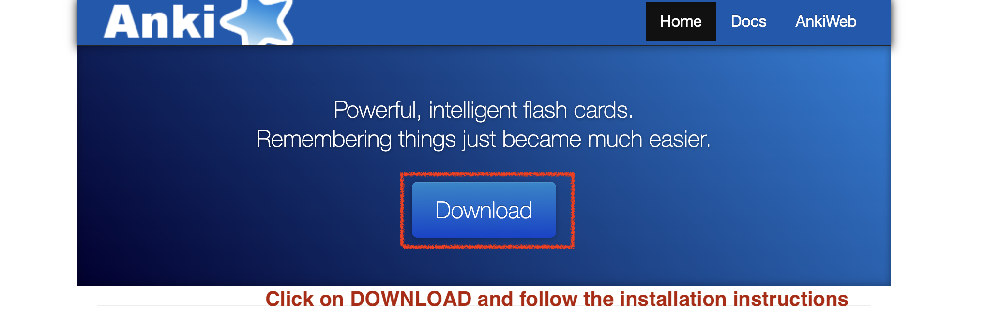
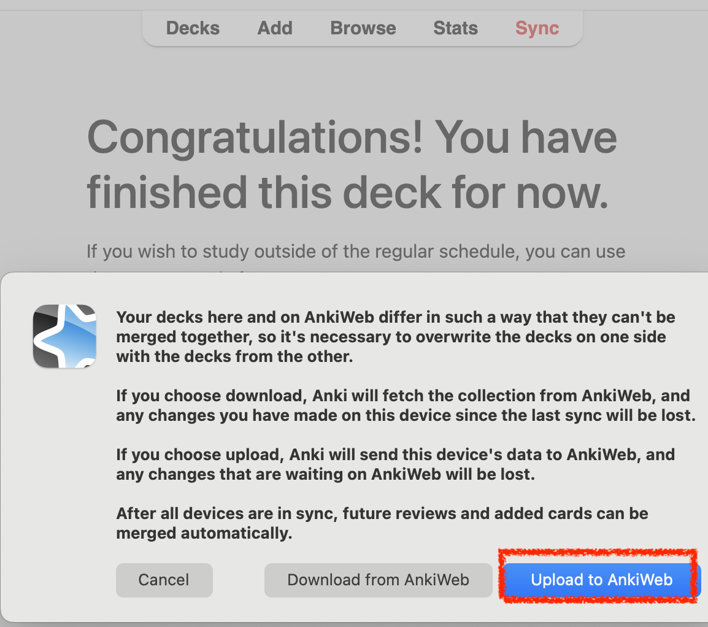

# Instructions to create an Anki account and download the repository {#cross_3}

## Create an account on Anki.

Using your computer, start by creating an Anki account. Creating an account is **free**. Visit the following website to do so:

<https://ankiweb.net/account/signup>

## Enter your email and create a password for Anki. {#cross_3}

## Check your email.

An email will be sent to the email account you indicated. *Verify* the account by clicking on the link sent to your email.

## Download Anki to your computer.

Download Anki to your **computer** from this website:

<https://apps.ankiweb.net/>

## Install Anki on your computer.

Follow the Anki installation process on your computer. Once the installation is complete, Anki will look *similar* to the image below:

## Click on sync.

## Enter your email and password. [The ones you created previously in 4.2](#cross_3).

## Download the repository.

*Note:* We tried to make gender-neutral sentences in Spanish (grammatically speaking), but some sentences have grammatical gender markers (e.g., estoy preocupad**a** vs. Estoy preocupad**o**).

There are two files: one with feminine gender markers and one with masculine gender markers. For example, the feminine file has sentences like *estoy tranquila* and the masculine file has sentences like *me siento solo.* 

Still, the differences between these two files are minimal since most of the sentences are shared. **Select the file with which you identify yourself and download it to your computer.**  

## Double click the file you downloaded.

It will take a few minutes to download and synchronize. Have patience. 

## If you see this prompt while synchronizing, select the “Upload to AnkiWeb” option. {-}

## You are ready!

Once it *finishes synchronizing,* the repository will be ready to be used.

The next step is optional and involves synchronizing the repository on your tablet or phone. You can practice on the computer, tablet, or both.

If you don't want or need to use your tablet or phone to practice, then skip to [how to practice sentences.](#cross_5) 
