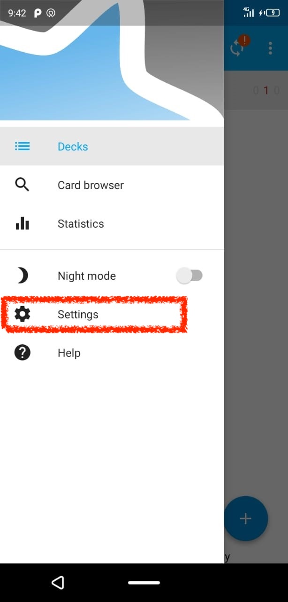

# Instructions to use the repository on your tablet or phone

Please note that, depending on the version of Anki, the repository *may not function properly on your tablet or smartphone.* So, we recommend using it on your computer only. The steps we mention below are optional. 

To follow these steps you must have **completed** the [instructions to create an Anki account and download the repository to your computer.](#cross_3)

## Open your App store (if you have an iPhone) or Play store (if you have an Android).

## Look for the app called Anki.

The Anki *icon* looks like this:

## Download the app.

Download the app on your tablet or phone. Please note that Anki is **free on Google play**, but requires **payment on the App Store.**

## Link your account.

Enter the app and click on the **three lines** usually found on the left side of the screen.

## Selecting these three lines will open the menu seen below.

Select where it says *settings*

## Now select the “sync” option

## Select the “AnkiWeb Account” option.

Enter your email and password.[The same email and password you used to create the Anki account](#cross_3)

**Note:** You may also be required to enter your Anki email and password as soon as you open the app.

## It will take a few minutes to sync and then you will see the repository.
